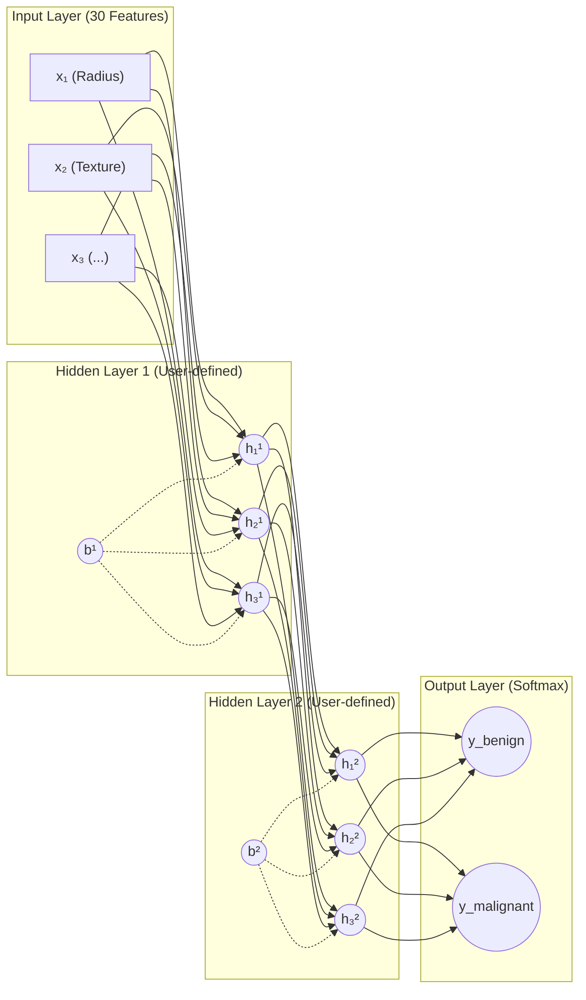

# Multilayer Perceptron 🧠🔬


An introduction to Artificial Neural Networks (ANN) featuring a modular **Multilayer Perceptron (MLP)** built entirely **from scratch in Python** (using only NumPy for matrix operations). The network is trained using feedforward propagation, backpropagation, and gradient descent to predict whether a breast cancer tumor is Malignant or Benign using the Wisconsin Breast Cancer Dataset (WDBC).

---

## 🏗️ Neural Network Architecture

This network is a fully connected feedforward neural network that supports dynamic hidden layers, learning rates, activation functions, and optimization algorithms.



---

## 🌟 Key Highlights & Strengths (Recruiter Cheat-Sheet)

If you are reviewing this project for a data science, machine learning, or software engineering role, here are the core competencies demonstrated:

*   **Mathematical Fundamentals (No High-Level Frameworks):** Developed without PyTorch, TensorFlow, or Scikit-learn. All core algorithms—including matrix calculus, partial derivative chain rules, activation functions, and optimizer weight updates—are coded manually.
*   **Vectorized Mathematics:** Implemented fully vectorized mathematical updates using matrix dot products in NumPy, maximizing cache efficiency and training speeds over iterative loops.
*   **Data Science Pipeline Best Practices:** Includes robust dataset analysis, train/validation splitting with random seeding for reproducibility, feature scaling (Standardization/Z-score normalization), and validation tracking.
*   **Numerical Stability & Optimization:** Features weight initialization strategies (e.g., He/Xavier initializations) and clipping/offset adjustments to prevent common numerical overflow issues (such as vanishing/exploding gradients or division-by-zero in log functions).
*   **Advanced Optimization (Bonus):** Extends basic Gradient Descent with advanced optimizers (like **Adam** or **Momentum**), learning curves comparison, and **Early Stopping** based on validation loss patience.

---

## 📊 Mathematical Foundations

The core operations implemented in the source code are:

### 1. Feature Scaling (Standardization)
To ensure balanced gradients and stable training across variables with differing magnitudes:
$$x_{standardized} = \frac{x - \mu}{\sigma}$$
where $\mu$ is the feature mean and $\sigma$ is the standard deviation.

### 2. Feedforward Propagation
For each layer $l$ with weights $W^{[l]}$, bias $b^{[l]}$, and activation function $g$:
$$Z^{[l]} = A^{[l-1]} \cdot W^{[l]} + b^{[l]}$$
$$A^{[l]} = g(Z^{[l]})$$
where the output layer uses **Softmax** for probabilistic distribution:
$$\text{Softmax}(z_i) = \frac{e^{z_i}}{\sum_{j} e^{z_j}}$$

### 3. Backpropagation (Chain Rule)
Calculates the gradient of the loss function with respect to weights and biases:
*   Output layer error: $dZ^{[L]} = A^{[L]} - Y$
*   Hidden layer error: $dZ^{[l]} = (dZ^{[l+1]} \cdot (W^{[l+1]})^T) * g'(Z^{[l]})$
*   Gradients: 
    $$dW^{[l]} = \frac{1}{m} (A^{[l-1]})^T \cdot dZ^{[l]}$$
    $$db^{[l]} = \frac{1}{m} \sum dZ^{[l]}$$

---

## 📂 Project Structure & Script Workflow

The project is divided into three distinct phases to replicate professional ML deployment:

```text
├── data/
│   └── data.csv            # Wisconsin Breast Cancer Dataset (Raw)
├── src/
│   ├── split.py            # Phase 1: Separates data into train/validation sets
│   ├── train.py            # Phase 2: Performs MLP training, validation, and saves model
│   ├── predict.py          # Phase 3: Loads model, predicts new cases, evaluates loss
│   └── utils/
│       ├── activations.py  # Sigmoid, Softmax, ReLU, and their derivatives
│       ├── optimizers.py   # SGD, Momentum, Adam optimizers
│       └── metrics.py      # Binary cross-entropy, Accuracy, F1-score
├── saved_model.json        # Serialized weights, biases, and network topology
└── README.md
```

---

## 🚀 Execution & Usage

### 1. Data Splitting
Partitions the dataset into training ($80\%$) and validation ($20\%$) sets:
```bash
python src/split.py --dataset data/data.csv --train-ratio 0.8 --seed 42
```

### 2. Training the Neural Network
Trains the MLP using custom hyperparameters. Saves the network's final parameters to `saved_model.json` and outputs learning curve plots (Loss/Accuracy vs Epochs):
```bash
python src/train.py --train data/train.csv --val data/val.csv --layers 30 24 24 2 --epochs 100 --learning-rate 0.05 --batch-size 16 --optimizer adam
```

### 3. Making Predictions
Loads the saved weights and evaluates performance on a separate dataset, outputting binary cross-entropy loss and accuracy metrics:
```bash
python src/predict.py --dataset data/val.csv --model saved_model.json
```

---

## 📈 Learning Curves & Metrics

At the end of the training phase, the program generates two validation graphs:
1.  **Loss Curve:** Training loss vs. Validation loss over epochs (useful for identifying overfitting and showing the convergence path).
2.  **Accuracy Curve:** Generalization accuracy on unknown examples.

Evaluations include:
*   **Binary Cross-Entropy Loss:**
    $$E = -\frac{1}{N} \sum_{n=1}^{N} \left[ y_n \log(p_n) + (1 - y_n) \log(1 - p_n) \right]$$
*   **F1-Score, Precision, and Recall:** To evaluate predictions objectively on unbalanced classification boundaries.
